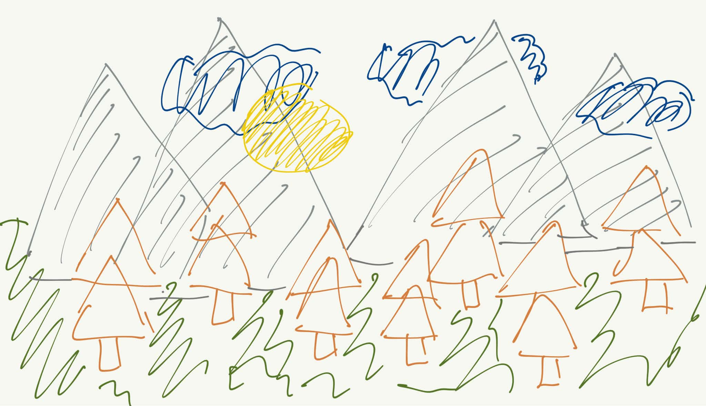
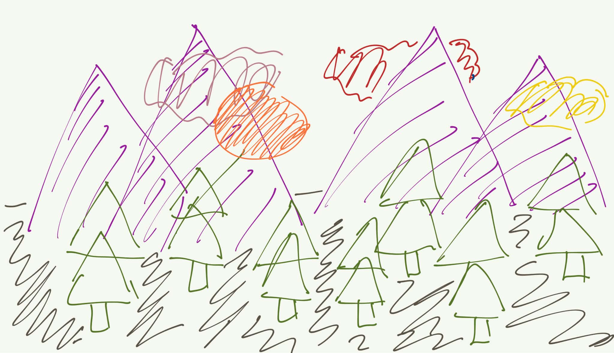
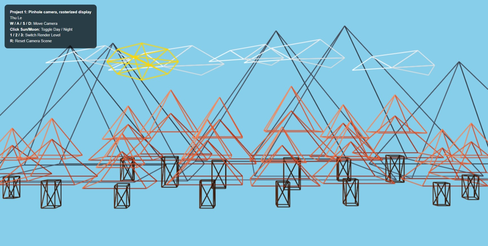
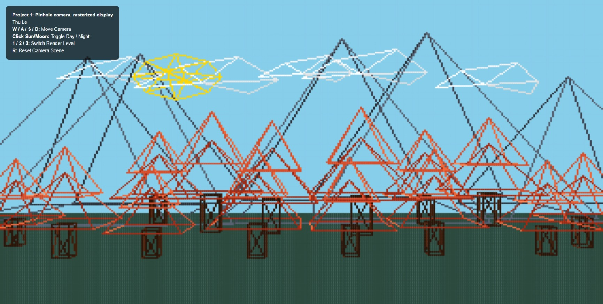
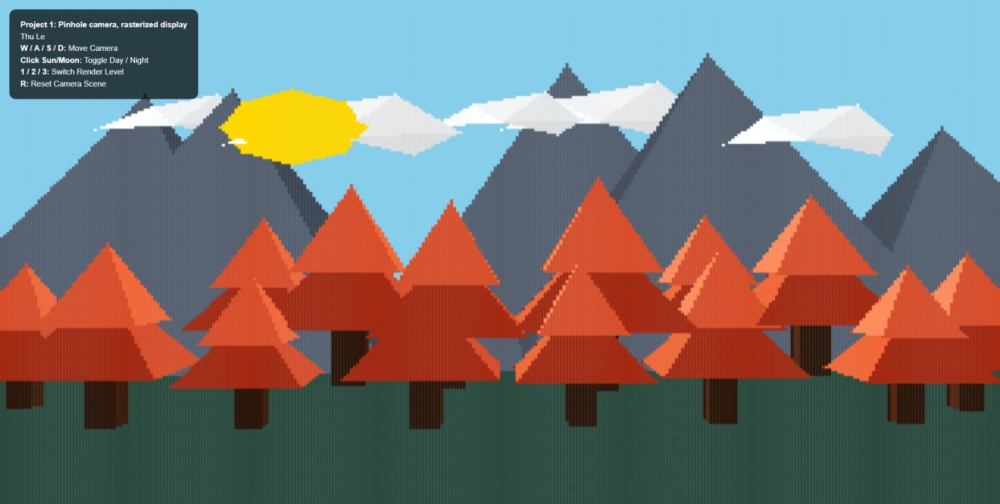
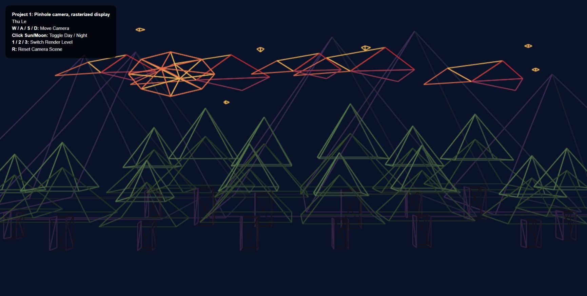
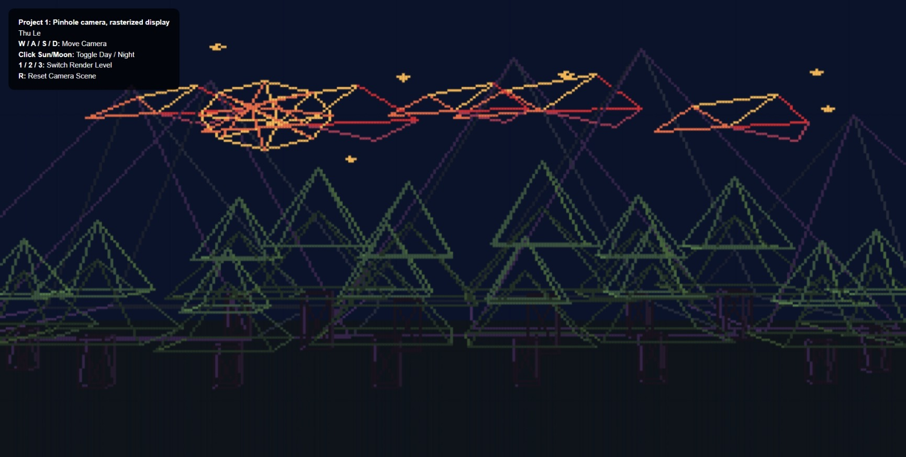
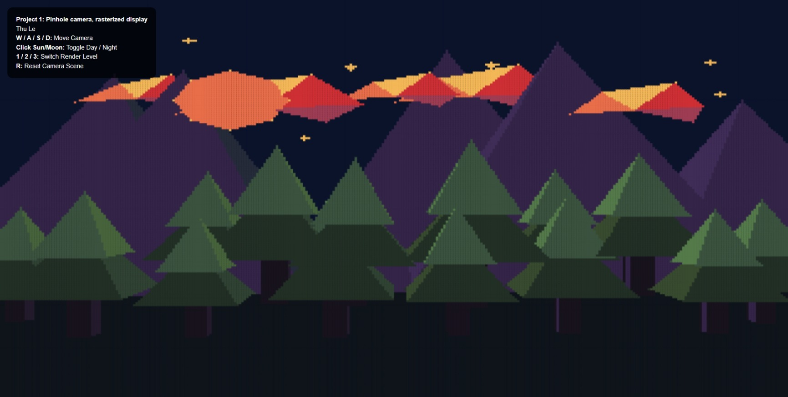

# Project 1: Pinhole camera, rasterized display
**Course:** COMPUTER GRAPHICS I (001)  
**Author:** Thu Le  
**Repository:** https://github.com/banh-canh-cua/Thu-Le---CS5160-Computer-Graphics-diary.git  
**Live Demo:** https://banh-canh-cua.github.io/Thu-Le---CS5160-Computer-Graphics-diary/  
**Demo Video:** https://youtu.be/bEoqOqwyg5E

## Design
My idea is to build an interactive 3D scenery with two modes (day and night), inspired by retro arcade games.

The scene shows a landscape with multiple objects and layers:
- Sky with sun/ moon, clouds, and stars
- Mountain ranges
- Pine tree forest

*Day mode*

*Night mode*

## Features and Controls
We can explore the virtual world from a first-person perspective by moving the camera to walk through the scenery.
- Move camera:
  - W: go forward
  - S: go backward
  - A: go left
  - D: go right
  - R: reset camera position and switch to day mode
- Switch between day and night: click the sun/ moon object on the screen
- Switch render level:
  - 1: line drawing
  - 2: pixelated line drawing
  - 3: pixelated colored objects
 

## Implementation

This project implements a full rasterization pipeline in JavaScript without external graphics libraries

### 3D Object Modeling
Objects are defined by vertices and faces centered around the origin $(0, 0, 0)$ as base models. To render multiple identical objects, we create multiple instances of these objects. Each includes a vector to define the position in 3D space and a scaling factor to define how big it is.

$$\mathbf{V}_{\text{world}} = (S \cdot \mathbf{V}_{\text{base}}) + \vec{T}$$

### Pinhole Camera Projection
A pinhole camera model was used to simulate a 3D world on a flat 2D screen:
- Camera-space transformation: the coordinates are converted relative to where the camera is currently positioned
- Near-plane culling: any vertex too close to the camera is discarded
- Perspective: Objects appear smaller the farther away they are because screen coordinates are divided by their distance ($z_{\text{cam}}$)
- Final coordinates are scaled to fit the display grid
- Use built-in canvas line-drawing functions to render the first level

### Custom Line Rasterization
- Incremental steps: the algorithm calculates the distance between two points ($du$, $dv$, $dz$) and determines the necessary step increments
- Depth testing: as it walks step-by-step from start to finish, it interpolates the depth ($z$) along the line to perform checks before drawing pixels and make sure that closer objects hide the ones behind them

### Triangle Surface Rasterization
Triangles are filled pixel-by-pixel using Barycentric coordinates:

- Bounding box: calculate a bounding box around the triangle and only check pixels within that region
- Test points in the triangle: for every pixel inside the box, area weights ($\alpha, \beta, \gamma$) are calculated. If all three weights are not negative, the pixel lies inside the triangle
- Depth and color interpolation: the Barycentric weights interpolate depth ($z$) across the surface to perform depth testing before coloring the pixels.

## Future work
Here are a few ideas I think but didn't have enough time or knowledge to do yet:
- Camera rotation
- Lighting and shading
- Animated objects: I planned to animate shooting stars or drifting clouds by updating the translation vectors, while keeping the same projection and rasterization
